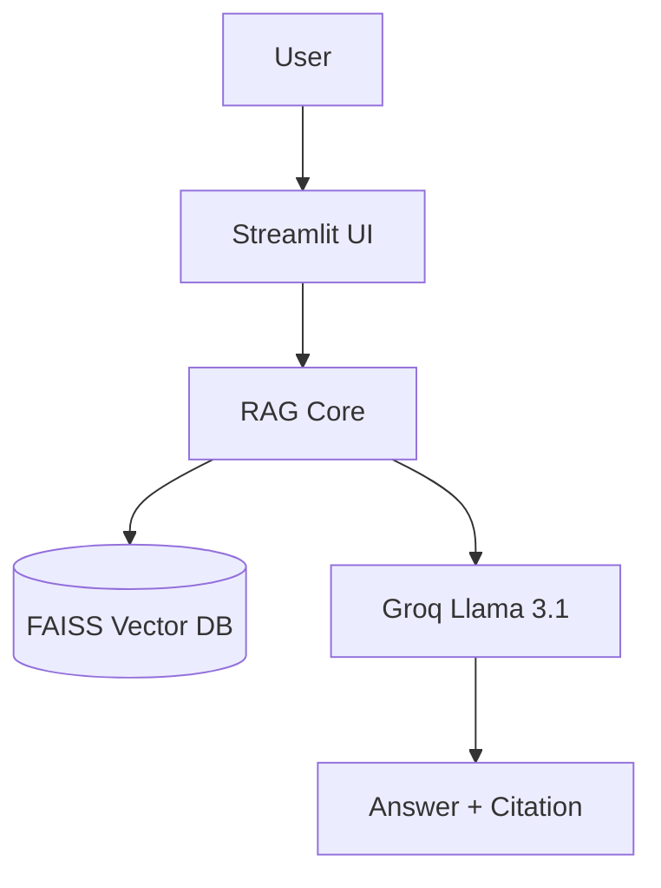
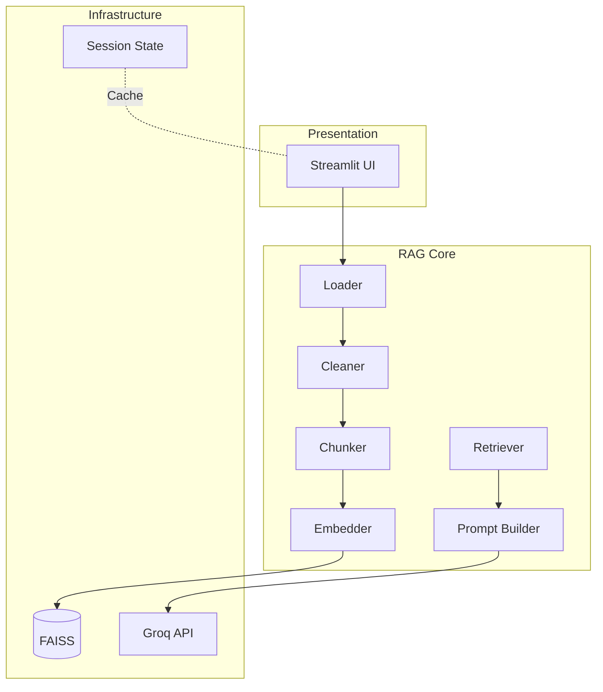
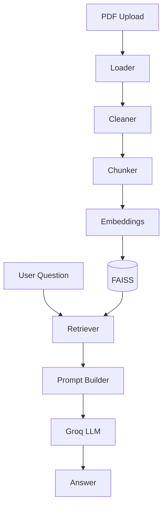

# Chapter 02 — System Architecture

## Purpose of this Chapter

This chapter explains the complete software architecture of the our RAG Assistant "Yomiko👩🏻🌸". It covers the logical layers, data flow, backend modules, frontend interaction, and the lifecycle of a user request from PDF upload to answer generation.

---

# 1. Architectural Philosophy

The application follows a layered architecture where each layer has a single responsibility.

- Presentation Layer handles user interaction.
- RAG Core performs document understanding and retrieval.
- Infrastructure Layer provides vector search and LLM services.

This separation makes the project modular, maintainable, and easily extensible.

---

# 2. High-Level Architecture

The following diagram shows the complete architecture of the Kawaii RAG Assistant.



The Streamlit application acts only as an orchestrator. All business logic resides inside the RAG Core.

---

# 3. Layered Architecture


## Presentation Layer

**Technology:** Streamlit

Responsibilities:

- Upload PDF
- Accept user questions
- Display answers
- Show citations
- Maintain session state

No AI logic is implemented here.

---

## RAG Core Layer

This layer contains the complete document intelligence pipeline.

| Module | Responsibility |
|---------|----------------|
| loader.py | Extract PDF pages |
| cleaner.py | Normalize text |
| chunker.py | Create overlapping chunks |
| embedder.py | Generate embeddings |
| store.py | Build FAISS index |
| retriever.py | Semantic search |
| prompt_builder.py | Create LLM prompt |
| llm.py | Generate answer |

Each module performs exactly one task.

---

## Infrastructure Layer

External services used by the application.

| Component | Purpose |
|-----------|----------|
| FAISS | Vector similarity search |
| Groq API | LLM inference |
| Streamlit Session State | In-memory cache |

The infrastructure layer can be replaced without changing business logic.

---

# 4. Backend Folder Structure

```text
backend/
│
├── app.py
│
├── src/
│   ├── ingestion/
│   ├── embeddings/
│   ├── vectorstore/
│   ├── retrieval/
│   └── generation/
│
└── tests/
```

### Why this structure?

Instead of organizing by file type, the project is organized by functional domains.

This improves readability and scalability.

---

# 5. Data Flow



The application transforms data through multiple representations.

| Stage | Data Type |
|--------|-----------|
| Upload | Binary PDF |
| Loader | Page Documents |
| Cleaner | Clean Documents |
| Chunker | Text Chunks |
| Embedder | Vector Embeddings |
| FAISS | Vector Index |
| Retriever | Relevant Chunks |
| Prompt | String |
| LLM | Answer |

Every stage has a clearly defined input and output.

---

# 6. Request Lifecycle

A new PDF follows this lifecycle.

1. Upload document
2. Parse pages
3. Clean extracted text
4. Create overlapping chunks
5. Generate embeddings
6. Store vectors inside FAISS
7. Cache vector store
8. Wait for user questions

Once indexed, the document is **never processed again** unless a new PDF is uploaded.

---

# 7. Question Lifecycle

When the user asks a question:

1. Convert question into an embedding
2. Search FAISS
3. Retrieve Top-K chunks
4. Build grounded prompt
5. Generate answer using Groq
6. Display answer with citations

This separates indexing from querying, improving performance.

---

# 8. Session State Architecture

The application stores three important objects.

| Variable | Purpose |
|----------|---------|
| vector_store | Cached FAISS index |
| filename | Prevent duplicate indexing |
| is_indexed | Track indexing status |

Because the vector store remains in memory, multiple questions can be answered without rebuilding embeddings.

---

# 9. Design Decisions

## Why modular architecture?

- Easier debugging
- Independent testing
- Component replacement
- Better scalability

## Why separate retrieval and generation?

Retrieval finds evidence.

Generation explains evidence.

Keeping them independent improves reliability.

---

# Chapter Summary

The system architecture follows a three-layer design consisting of Presentation, RAG Core, and Infrastructure. The backend is divided into functional modules with single responsibilities, while FAISS and Groq provide scalable retrieval and generation capabilities. Session State ensures that indexing occurs only once, making the application efficient for repeated queries.