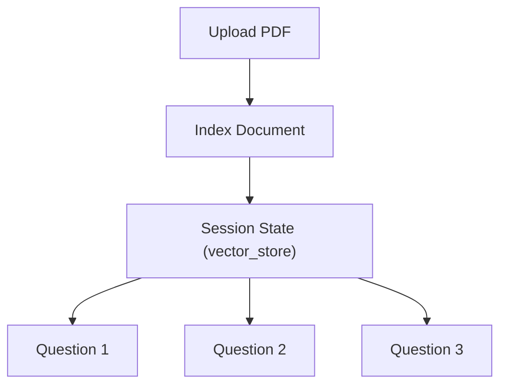

# Chapter 05 — End-to-End Workflow

## Purpose of this Chapter

This chapter explains the complete execution lifecycle of Yomiko👩🏻🌸 the RAG Assistant from the moment a user uploads a PDF until the final answer is generated. It combines the indexing pipeline, retrieval pipeline, session state, and application orchestration into one unified workflow.

---

# 1. Complete System Lifecycle

The application executes in two independent phases.

1. Document Indexing (runs once per PDF)
2. Question Answering (runs for every query)

This separation is the primary optimization of the system.

---

# 2. End-to-End Architecture

## Sequence Diagram

The following sequence illustrates the complete interaction between the user, Streamlit application, FAISS retriever, and Groq LLM.


The indexing pipeline is executed only once, while the retrieval pipeline is executed for every user question.

---

# 3. Phase 1 — Document Indexing

## Step 1 — Upload

The user uploads a PDF through Streamlit.

Input:

```text
RAG_Fundamentals_Notes.pdf
```

The uploaded file is temporarily stored using Python's `tempfile` module.

---

## Step 2 — PDF Parsing

`loader.py` extracts page-wise text.

Example output:

```python
{
    "text": "...",
    "metadata": {
        "source": "RAG.pdf",
        "page": 8
    }
}
```

Result:

22 pages become 22 structured document objects.

---

## Step 3 — Cleaning

The cleaner removes formatting noise while preserving semantic structure.

Operations include:

- Remove carriage returns
- Replace tabs
- Remove empty lines
- Normalize spaces

The output remains page-wise.

---

## Step 4 — Chunk Creation

Each page is divided into overlapping segments.

Configuration:

| Parameter | Value |
|----------|------:|
| Chunk Size | 1000 |
| Overlap | 200 |

Result:

22 Pages → 30 Chunks

Each chunk receives a unique `chunk_id`.

---

## Step 5 — Embedding Generation

Every chunk is converted into a 384-dimensional embedding using:

`all-MiniLM-L6-v2`

Result:

30 Chunks → 30 Embeddings

These embeddings become searchable vectors.

---

## Step 6 — FAISS Index Construction

The embeddings are inserted into the FAISS vector index.

Simultaneously, the original chunk text and metadata are stored inside the document collection.

At this point, indexing is complete.

---

# 4. Session State Optimization

The application stores the vector database inside Streamlit Session State.

Cached objects:

| Variable | Purpose |
|----------|----------|
| vector_store | FAISS index |
| filename | Detect new uploads |
| is_indexed | Index status |

Because of caching, the PDF is **never re-indexed** while asking multiple questions.

This significantly reduces latency.

---

## Session State Architecture

The FAISS index is cached after indexing, preventing repeated preprocessing.



The document is indexed only once, while multiple questions reuse the same vector database.

---

# 5. Phase 2 — Question Answering

Suppose the user asks:

> What is chunk overlap?

The document is **not processed again**.

Only the query enters the retrieval pipeline.

---

## Step 1 — Query Embedding

The question becomes a 384-dimensional embedding using the same embedding model used during indexing.

Maintaining the same semantic space is essential for accurate retrieval.

---

## Step 2 — Similarity Search

The retriever performs:

```python
index.search(query_embedding, top_k=3)
```

FAISS returns the nearest vector IDs.

Example:

```text
[17, 3, 9]
```

These represent the most semantically similar chunks.

---

## Step 3 — Metadata Mapping

The returned vector IDs are mapped back into the document collection.

Result:

- Chunk text
- Source filename
- Page number

This enables transparent citations.

---

## Step 4 — Prompt Construction

The Prompt Builder combines:

- Retrieved context
- User question
- System instructions

Example:

```text
Context:
[Page 8]
...

Question:
What is chunk overlap?

Answer:
```

Only retrieved evidence is provided to the LLM.

---

## Step 5 — Answer Generation

The grounded prompt is sent to Groq's hosted Llama model.

The LLM generates a natural-language answer using only the supplied context.

The UI then displays:

- Answer
- Source pages

---

# 6. Data Transformation Lifecycle

| Stage | Representation |
|--------|----------------|
| Upload | Binary PDF |
| Loader | Page Documents |
| Cleaner | Clean Documents |
| Chunker | Chunks |
| Embedder | 384-d Vectors |
| FAISS | Vector Index |
| Retriever | Top-K Chunks |
| Prompt Builder | Prompt String |
| LLM | Final Answer |

Every module transforms the data into a new representation while preserving metadata.

---

## Data Transformation Pipeline

Each module transforms the document into a new representation.


---

# 7. Error Handling Strategy

The backend includes defensive validation throughout the pipeline.

| Error | Handling |
|--------|----------|
| Missing PDF | FileNotFoundError |
| Wrong extension | ValueError |
| Empty upload | Streamlit validation |
| Duplicate upload | Filename comparison |
| Re-indexing | Session State prevention |

These validations improve reliability during production usage.

---

# 8. Performance Characteristics

| Operation | Frequency |
|-----------|-----------|
| PDF Parsing | Once |
| Cleaning | Once |
| Chunking | Once |
| Embedding | Once |
| FAISS Index | Once |
| Query Embedding | Every Question |
| Retrieval | Every Question |
| LLM Generation | Every Question |

The expensive preprocessing operations occur only once per uploaded document.

---

# 9. Engineering Highlights

- Modular backend architecture
- Single Responsibility Principle
- Semantic retrieval using embeddings
- FAISS vector database
- Grounded prompt engineering
- Page-level explainability
- Session-based caching
- LLM-independent design

The architecture allows the embedding model, vector database, or language model to be replaced with minimal code changes.

---

# Chapter Summary

Yomiko👩🏻🌸 the RAG Assistant separates document indexing from question answering to maximize efficiency and modularity. Documents are parsed, cleaned, chunked, embedded, and indexed only once. During querying, the application performs semantic retrieval over FAISS, constructs a grounded prompt, and generates explainable answers with page citations using Groq's Llama model. This end-to-end workflow forms the complete Retrieval Augmented Generation pipeline implemented in the project.